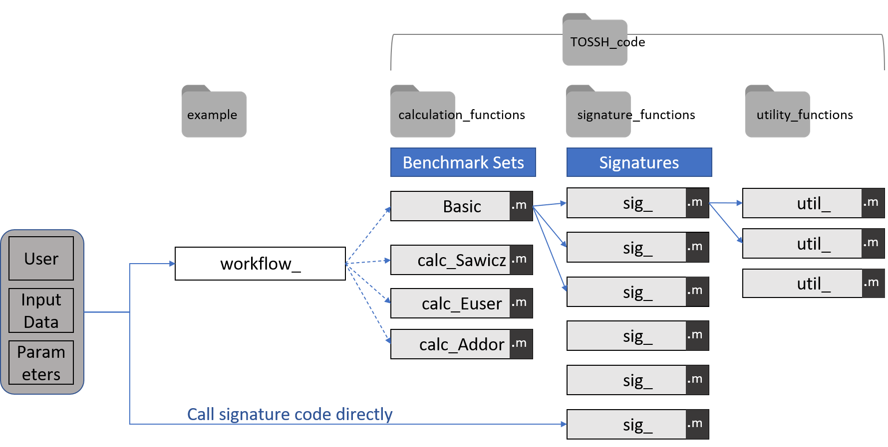

.. _p1_overview:

Overview
========

MATLAB functions 
----------------

TOSSH consists of different types of MATLAB functions.
The three core types are: **signature functions**, **utility functions**, and **calculation functions**.
An overview of the toolbox structure is given below.

Signature functions 
^^^^^^^^^^^^^^^^^^^
Signature functions (*sig_xxx.m*) calculate different hydrological signatures. 
Note that some functions just call MATLAB functions (e.g. mean flow). 
They, however, provide data checks and are included to ensure consistency.
Signature functions start with a short description, perform input parameter checks, data checks, and calculate the signature.
For example, a shortened version of the mean flow signature *sig_Q_mean.m* looks as follows::

	function [Q_mean, error_flag, error_str] = sig_Q_mean(Q, t)
	%sig_Q_mean calculates mean flow of time series.
	[...]

	% check input parameters
	[...]

	% data checks
	[error_flag, error_str, timestep, t] = util_DataCheck(Q, t);
	if error_flag == 2
		Q_mean = NaN;
		return
	end

	% calculate signature
	Q_mean = mean(Q,'omitnan'); 
		
	end

Some signature functions return more than one signature and optionally create a plot (e.g. *sig_RecessionAnalysis.m*).
Signature functions with plotting functionality optionally return a figure handle that allows to manipulate the figure. 
Every signature function optionally returns an error flag and an error string, which contain information about problems that occurred during signature calculation. 

We provide two templates which should be used to implement new signatures in a consistent way:
a basic template *sig_TemplateBasic.m* which only contains Q, t, and optional parameters as inputs 
and an advanced template *sig_TemplateAdvanced.m* which contains all possible inputs (Q, t, P, PET, T, required parameters, and optional parameters).

Utility functions
^^^^^^^^^^^^^^^^^
Utility functions (*util_xxx.m*) are used within some of the signature functions but are kept separate to enhance reusability.
For example, the data are checked for certain problems using *util_DataCheck.m*::

	function [error_flag, error_str, timestep, t] = util_DataCheck(Q, t, varargin)
	%util_DataCheck checks data for various things.
	[...]

	% check input parameters
	[...]

	% default setting reads as good data
	error_flag = 0;
	error_str = '';
	[...]

	% data checks
	if min(Q)<0
		error_flag = 2;
		error_str = ['Error: Negative values in flow series. ', error_str];
		return
	end
	[...]

	end

Calculation functions
^^^^^^^^^^^^^^^^^^^^^
Signature calculation functions (*calc_xxx.m*) calculate sets of signatures for a given dataset. 
The signature sets are described in the corresponding paper and :ref:`here <p2_signatures>`.

Other scripts and functions
^^^^^^^^^^^^^^^^^^^^^^^^^^^
There are a few other scripts and functions. 
Most of them are workflow scripts (e.g. *workflow_1_basic.m*) which show how the toolbox can be used with some example data (see :ref:`here <p3_examples>` for more information on workflow scripts).
The remaining functions are helper functions used to load data, to create plots, etc., and they are mainly used in the workflow scripts.

Input data
----------

Input time series
^^^^^^^^^^^^^^^^^
Every signature function requires streamflow data (as a MATLAB vector, typically in mm/timestep) and corresponding dates (as a MATLAB datetime vector).
Additionally, some signatures require precipitation, potential evapotranspiration (both in mm/timestep), or temperature data (in °C).

Input parameters
^^^^^^^^^^^^^^^^
Most signatures that require parameter values will use default parameter values unless the parameters are specified in the inputs. 
Some signatures always require parameter values to be specified. 
This is explained in the function descriptions and in the workflow scripts.

Data checks
^^^^^^^^^^^
Every signature function performs data checks and either returns a warning or an error via an error string. We check for:

* NaN values
* Inconsistencies in the time vector, e.g. missing days
* General problems with the input data, e.g. unrealistic values, time series of different lengths

Errors and warnings
-------------------
Every signature function optionally returns an error flag (a number describing the error type, e.g. 2 corresponds to a data check error) 
and an error string (e.g. 'Error: Negative values in flow series.'). 
These contain warnings and errors that might occur during the data check or during signature calculation.
If such an error occurs, NaN is returned as signature value without stopping code execution.
This enables signature calculations for large samples of catchments without breaking.
The error strings indicate why a certain signature could not be calculated for a certain catchment.

There are still normal Matlab warnings and errors, for example if input parameters are specified incorrectly. 
Such errors stop code execution but can be avoided if the functions are called with input data that are in the correct format.

Required MATLAB toolboxes
-------------------------
The toolbox was developed using Matlab R2020a.
Some functions require MATLAB toolboxes, which are listed below:

* Statistics and Machine Learning Toolbox v11.3
* Optimization Toolbox v8.1 

..
	[comment]: <>  - 'MATLAB'	'9.4'
	[comment]: <> - Signal Processing Toolbox	v8.0 (xcorr)
	[comment]: <> - Statistics and Machine Learning Toolbox v11.3  (skewness, fitnlm)
	[comment]: <> - Optimization Toolbox v8.1 (nsqnonlin, fminbnd)
	[comment]: <> - (tiedrank: Statistics and Machine Learning Toolbox)
	[comment]: <> - (findpeaks: Signal Processing Toolbox)

Using the toolbox
-----------------
Example workflow scripts that show how to use the toolbox are provided :ref:`here <p3_examples>` and can be found in *TOSSH/example/*.

Note that the Mapping Toolbox is used for some plots in the workflow scripts, but it is not required for any signature calculation.
