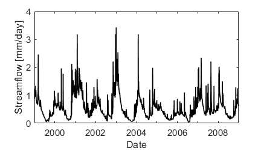

- 
{:toc}

This workflow shows basic functionalities of TOSSH with example data from one catchment. 
The example data used in this workflow are taken from CAMELS-GB (Coxon et al., 2020), 
see 
<a href="README_example_data.txt" target="_blank">README_example_data.txt</a>
for more information on the data sources.

### Input data
Every signature requires a streamflow (Q) time series and a corresponding 
date vector (t). The date vector should be in datetime format, but 
datenum format is also accepted and internally converted. Here is an 
example of Q and t vectors in the correct format:

```
Q = [1.14;1.07;2.39;2.37;1.59;1.25;1.35;1.16;1.27;1.14]; 
t = [datetime(1999,10,1,0,0,0):datetime(1999,10,10,0,0,0)]';
```

Typically, users will have their own data which they want to analyse. 
We provide an example file to get a more realistic time series.
The example file also contains precipitation (P), potential
evapotranspiration (PET), and temperature (T) data which are required for some signatures.
The paths are relative and assume that we are in the TOSSH directory.

```
path = './example/example_data/'; % specify path
data = load(strcat(path,'33029_daily.mat')); % load data
t = data.t;
Q = data.Q; % streamflow [mm/day]
P = data.P; % precipitation [mm/day]
% Note: PET and T example data are provided but not used here.
% PET = data.PET; % potential evapotranspiration [mm/day]
% T = data.T; % temperature [degC]

```
### Plot data
We can plot the data to get a first idea of the hydrograph.

```
figure('pos',[100 100 350 200])
plot(t,Q,'k-','linewidth',1.0)
xlabel('Date')
ylabel('Streamflow [mm/day]')
```



More information on how to specify input data can be found [here](./p1_overview.md/).


### Calculate signatures
Once the input data are loaded, we can calculate different signatures.
We start by calculating the mean flow Q_mean.

```
Q_mean = sig_Q_mean(Q,t);
fprintf('Q_mean = %.2f \n',Q_mean)
```

```
Q_mean = 0.54 
```

Some signatures can be calculated using different methods and/or
parameter values. For example, there are different options to calculate 
the baseflow index (BFI). The default method is the UKIH smoothed minima 
method with a parameter of 5 days.
```
BFI_UKIH = sig_BFI(Q,t);
fprintf('BFI_UKIH = %.2f \n',BFI_UKIH)
```

```
BFI_UKIH = 0.82 
```

Alternatively, we can use the Lyne-Hollick filter with a filter parameter of 0.925.
```
BFI_LH = sig_BFI(Q,t,'method','Lyne_Hollick');
fprintf('BFI_LH = %.2f \n',BFI_LH)
```

```
BFI_LH = 0.78
```
We can also change the parameter value of the UKIH method to 10 days.
```
BFI_UKIH10 = sig_BFI(Q,t,'method','UKIH','parameters',10);
fprintf('BFI_UKIH10 = %.2f \n',BFI_UKIH10)
```

```
BFI_UKIH10 = 0.77 
```
As we can see, all three options lead to slightly different values.
More details and examples on the different methods/parameters can be
found in the code of each function 
(e.g. <a href="./matlab/TOSSH_code/TOSSH/TOSSH_code/signature_functions/sig_BFI.html" target="_blank">sig_BFI.m</a>).

Some signatures also require precipitation (P) input time series. For
example, the total runoff ratio requires both Q and P time series.
```
TotalRR = sig_TotalRR(Q,t,P);
fprintf('TotalRR = %.2f \n',TotalRR)
```

```
TotalRR = 0.27 
```

Some signature functions come with a plotting functionality. For example, 
we can calculate the slope of the flow duration curve (FDC) and plot the
result.
```
FDC_slope = sig_FDC_slope(Q,t,'plot_results',true);
fprintf('FDC_slope = %.2f \n',FDC_slope)
```

```
FDC_slope = -1.91 
```


Some signatures are combinations of existing signatures, e.g. the
baseflow fraction (K_b) defined as the ratio between mean baseflow Q_b and 
mean precipitation P. This signature can also be 
calculated as K_b = BFI*TotalRR. We therefore do not provide an extra
signature function, but suggest to use the two existing functions.
```
K_b = sig_BFI(Q,t)*sig_TotalRR(Q,t,P);
fprintf('K_b = %.2f \n',K_b)
```
```
K_b = 0.21
```

More information on the signatures contained in TOSSH can be found [here](./p2_signatures.md/).


### Warnings and errors
Each signature function can return a warning/error output. These 
warning/error outputs indicate problems during signature calculation, but
they do not stop code execution like a normal Matlab error would do. Two
outputs can be retrieved: an error flag (error_flag) that corresponds to 
a certain type of warning/error, and a string (error_str) that decribes
the warning/error. If multiple warnings/errors occur, they are
all listed in the error string, starting with the one that occurred last.

A warning (error_flag = 1) typically indicates that the signature can be 
calculated but should be interpreted with care, e.g. because there are 
NaN values in the time series.

```
Q(1:10) = NaN;
[Q_mean, error_flag, error_str] = sig_Q_mean(Q,t);
fprintf('Q_mean = %.2f \n',Q_mean)
fprintf(error_str+"\n")
```

```
Q_mean = 0.54 
Warning: Ignoring NaNs in streamflow data. 
```

We get the same mean value as before since the ten removed values do not
influence the result much. In other cases, significant amounts of NaN
entries might cause more problems.

An error (error_flag > 1) indicates that the signature could not be 
calculated, e.g. because there is a problem with the input data. For 
example, if the input time series contains negative and thus physically 
impossible values, NaN is returned. 

```
Q(1:10) = -1.0;
[Q_mean, error_flag, error_str] = sig_Q_mean(Q,t);
fprintf('Q_mean = %.2f \n',Q_mean)
fprintf(error_str+"\n")
```

```
Q_mean = NaN 
Error: Negative values in flow series.
```

Since these warnings/errors do not stop the execution of the code, we can
run the signature code for many catchments without breaking, even if
for some of the catchments the signature cannot be calculated.

There are also "normal" errors which can happen if the input
parameters are specified incorrectly (wrong format, wrong range, etc.).
For example, if we swap Q and t in the input, we will get an error. 

```
Q_mean = sig_Q_mean(t,Q);
```

```
Error using sig_Q_mean (line 42)
The value of 'Q' is invalid. It must satisfy the function:
@(Q)isnumeric(Q)&&(size(Q,1)==1||size(Q,2)==1).

Error in workflow_1_basic (line 149)
Q_mean = sig_Q_mean(t,Q);
```

While this will stop code execution, such errors are
avoidable by specifying all inputs correctly. 


### Further examples
Example scripts can be found in *TOSSH/example/*. 
- <a href="./matlab/example/TOSSH/example/workflow_1_basic.html" target="_blank">workflow_1_basic.m</a> contains the code shown on this page which shows basic functionalities of TOSSH with example data from one catchment..
- <a href="./matlab/example/TOSSH/example/workflow_2_advanced.html" target="_blank">workflow_2_advanced.m</a> contains code that shows advanced functionalities of TOSSH with example data from multiple catchments.
- <a href="./matlab/example/TOSSH/example/workflow_3_time_resolution.html" target="_blank">workflow_3_time_resolution.m</a> contains code that shows how to use TOSSH with example data from the same catchment but with different time resolution.
- <a href="./matlab/example/TOSSH/example/workflow_4_CAMELS_US.html" target="_blank">workflow_4_CAMELS_US.m</a> contains code that shows how to use TOSSH to calculate the Addor et al. (2018) signatures using the CAMELS dataset.
- <a href="./matlab/example/TOSSH/example/workflow_5_CAMELS_GB.html" target="_blank">workflow_5_CAMELS_GB.m</a> contains code that shows how to use TOSSH to calculate various signatures using the CAMELS GB dataset (Coxon et al., 2020).


For each signature, we also provide small examples in the description of each m-file. 
```
function [Q_mean, error_flag, error_str] = sig_Q_mean(Q, t)
%sig_Q_mean calculates mean flow of time series.
[...]
%   EXAMPLE
%   % load example data 
%   data = load('example/example_data/33029_daily.mat'); 
%   Q = data.Q; 
%   t = data.t;
%   Q_mean = sig_Q_mean(Q,t);
[...]
```

If any of the examples, errors or warnings are unclear, please [contact](./p4_contact.md/) us. 


### References

Coxon, G., Addor, N., Bloomfield, J.P., Freer, J., Fry, M., Hannaford, J., Howden, N.J., Lane, R., Lewis, M., Robinson, E.L. and Wagener, T., 2020. CAMELS-GB: Hydrometeorological time series and landscape attributes for 671 catchments in Great Britain. Earth System Science Data Discussions, pp.1-34.
